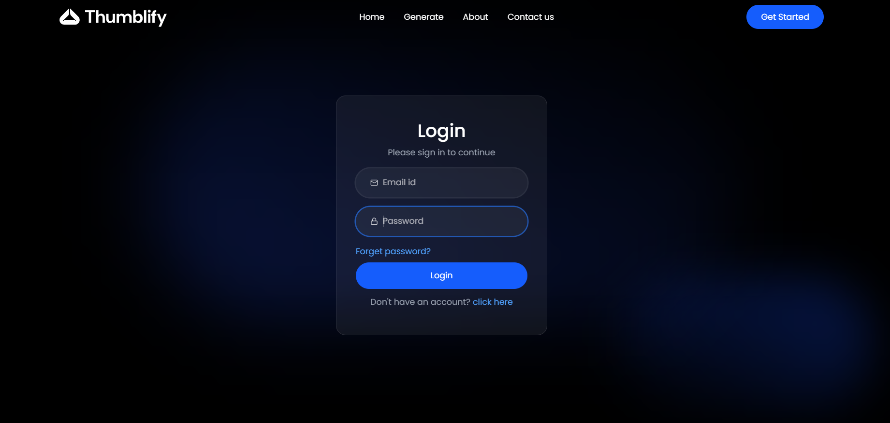
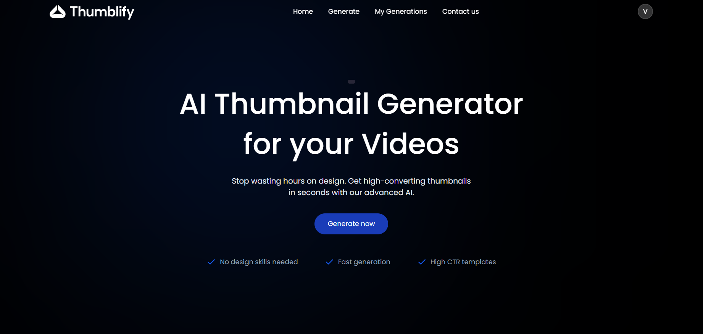
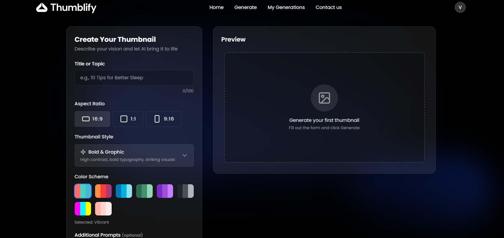
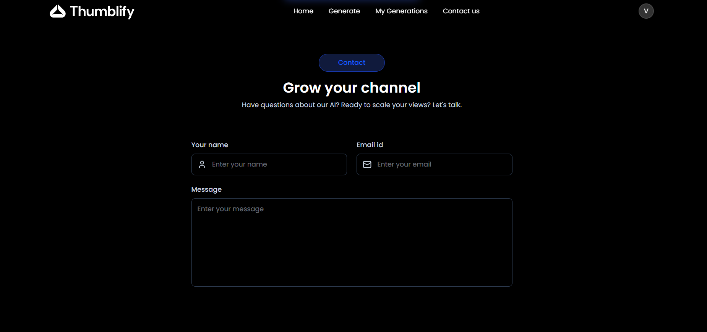

#  Thumblify – AI Thumbnail Generator

An AI-powered full-stack web application that helps creators generate professional-quality thumbnails from text prompts in seconds. The application provides a modern user interface, secure authentication, and a seamless workflow for creating and downloading AI-generated thumbnails.

# Features


- Authentication — Email/password signup and login with hashed passwords (bcrypt) and secure, MongoDB-backed sessions (express-session + connect-mongo)
- AI Thumbnail Generation — Generates thumbnails via Google's Gemini image model (gemini-3-pro-image-preview) based on a title, optional prompt, style, color scheme, and aspect ratio
-Style & Color Presets — Choose from styles like Bold & Graphic, Tech/Futuristic, Minimalist, Photorealistic, and Illustrated, plus curated color schemes (vibrant, sunset, forest, neon, purple, monochrome, ocean, pastel)
- Aspect Ratio Control — Generate thumbnails in 16:9, 1:1, or 9:16
- Cloud Image Storage — Generated thumbnails are uploaded and served via Cloudinary
- Generation History — View, preview, and delete past thumbnails from "My Generations"
- Modern UI — React 19 + Tailwind CSS v4 frontend with smooth scrolling (Lenis), animations (Motion), and toast notifications

# Tech Stack

# Frontend (/client)

-React 19 + TypeScript
-Vite
-Tailwind CSS v4
-React Router v7
-Axios

# Backend (/server)

-Node.js + Express 5 + TypeScript
-MongoDB + Mongoose
-express-session with connect-mongo (session store)
-bcrypt (password hashing)
-Google GenAI SDK (@google/genai) for image generation
-Cloudinary (image hosting)

##  Project Preview

> Add screenshots here after deployment.

<h2>login Page</h2>


<h2>Home Page</h2>


<h2>Generate Page</h2>


<h2>Contact Page</h2>



##  Getting Started

Clone the repository

```bash
git clone <your-repository-url>
```

Install dependencies

```bash
npm install
```

Start the frontend

```bash
npm run dev
```

Start the backend

```bash
npm run server
```

##  Live Demo

Add your deployed application link here.


